# Pet Adoption Platform - WhosYourPal

<!-- Optional: Replace with a nice banner image if you have one -->
<!--  -->

A comprehensive web application built with Flask and MySQL to connect potential adopters with shelter animals. This platform provides distinct interfaces and features for both regular users (adopters) and shelter administrators.

## Showcase

Here's a glimpse into the platform:

| Feature                 | Screenshot                                               |
| :---------------------- | :------------------------------------------------------- |
| **Homepage**            | 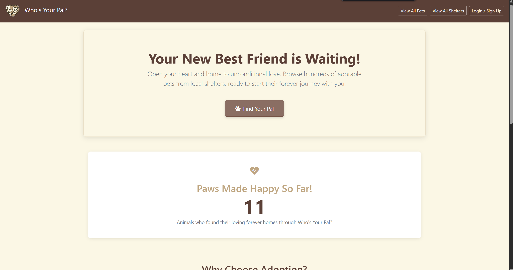                         |
| **Pet Listings (All)**  | 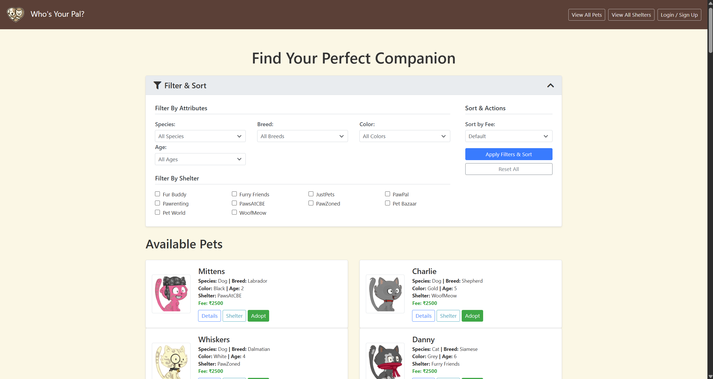                 |
| **Pet Details**         | 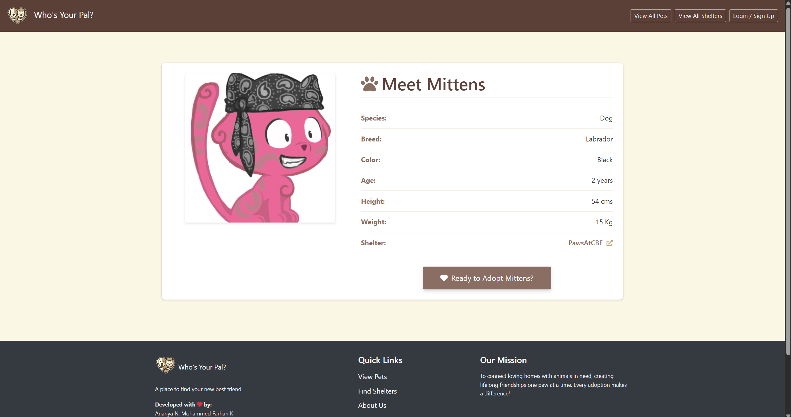                  |
| **Shelter Details**     | 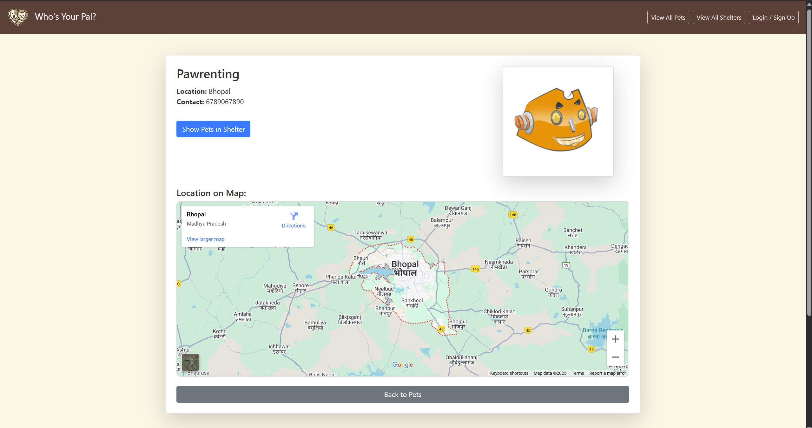          |
| **User Dashboard**      | 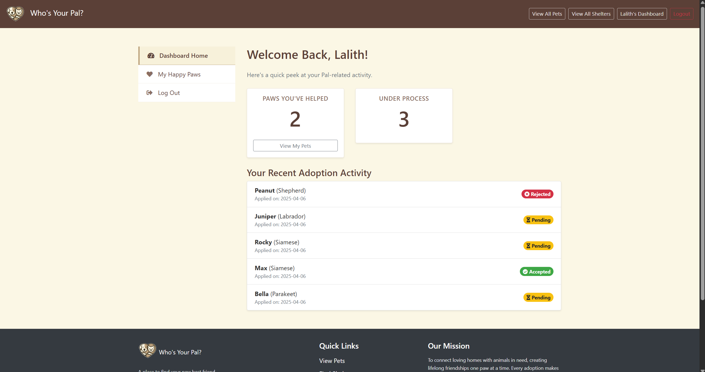              |
| **User Owned Pets**     | 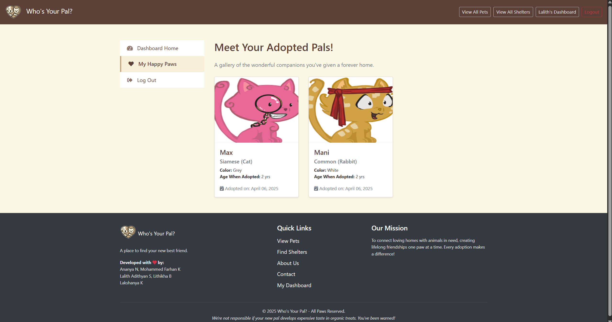            |
| **Admin Dashboard**     | 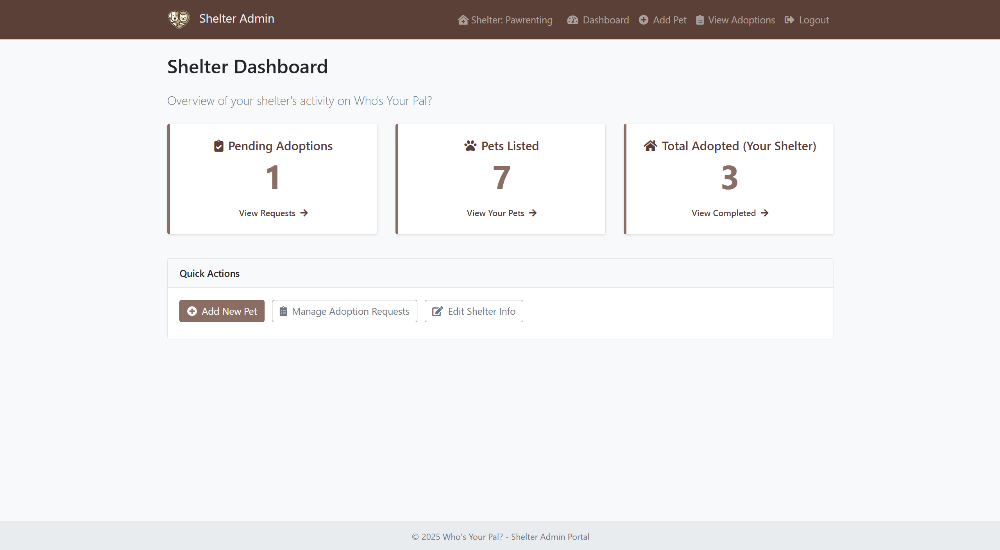       |
| **Admin Add Pet**       | 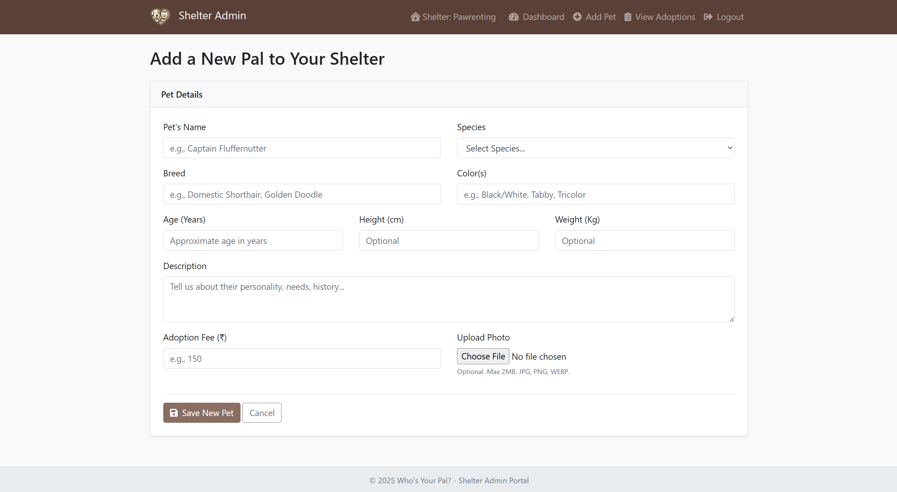             |
| **Admin Adoptions View**| 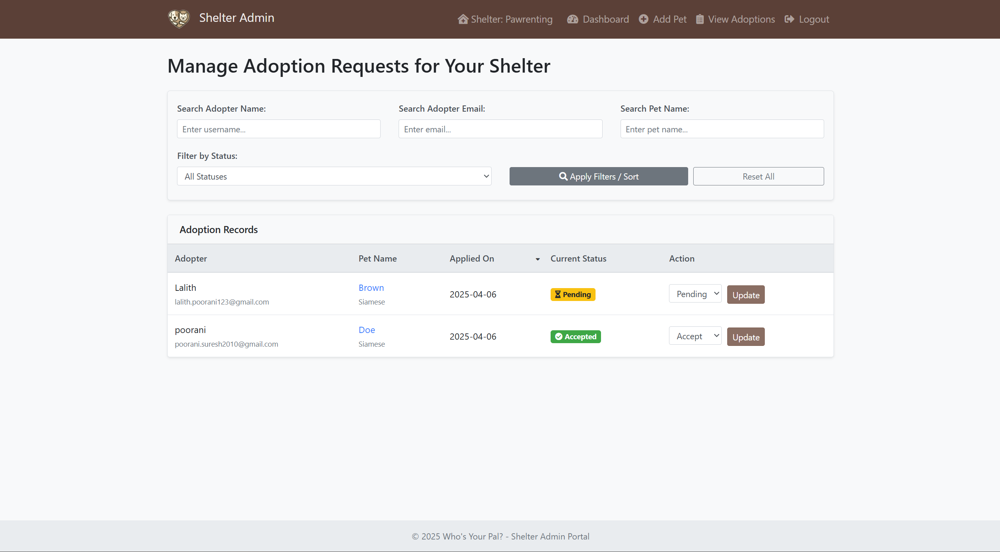|
| **Admin Shelter Pets**  | 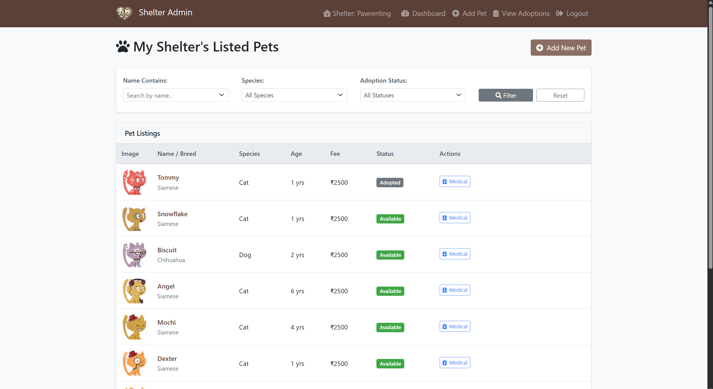  |
| **Admin Add Med Record**| 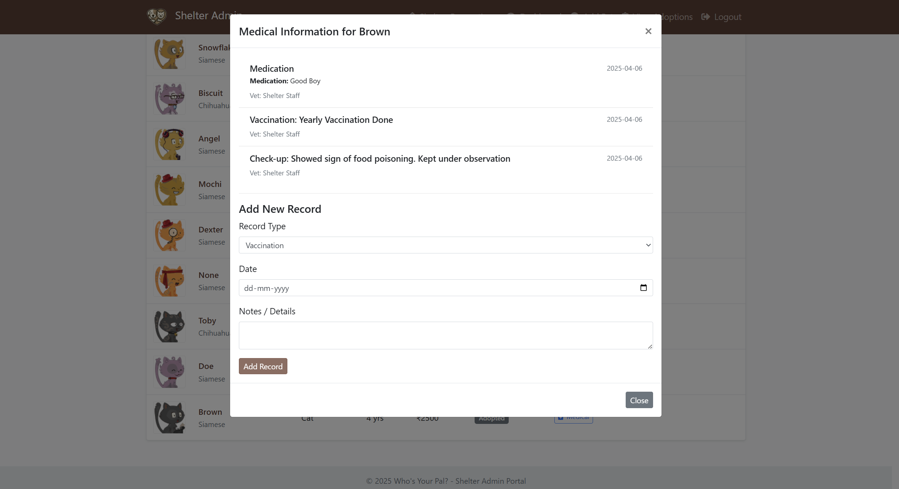|
| **Login Page**          | 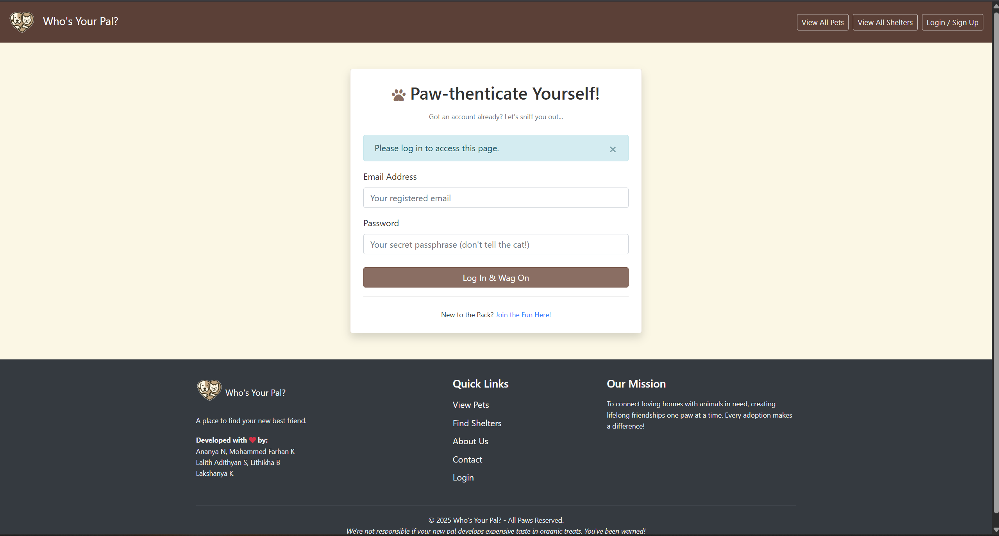                      |
| **Adoption Updated**    | 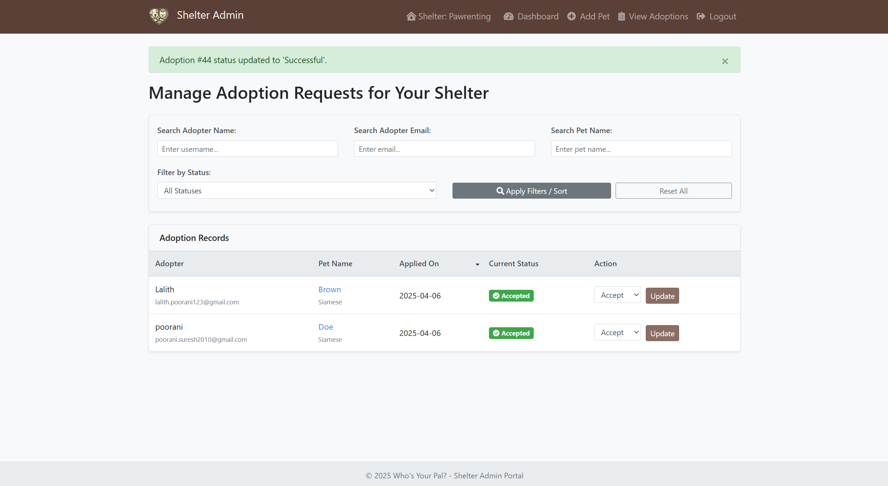 | <!-- Added this based on your files -->
| **Updated Owned Pets**  | 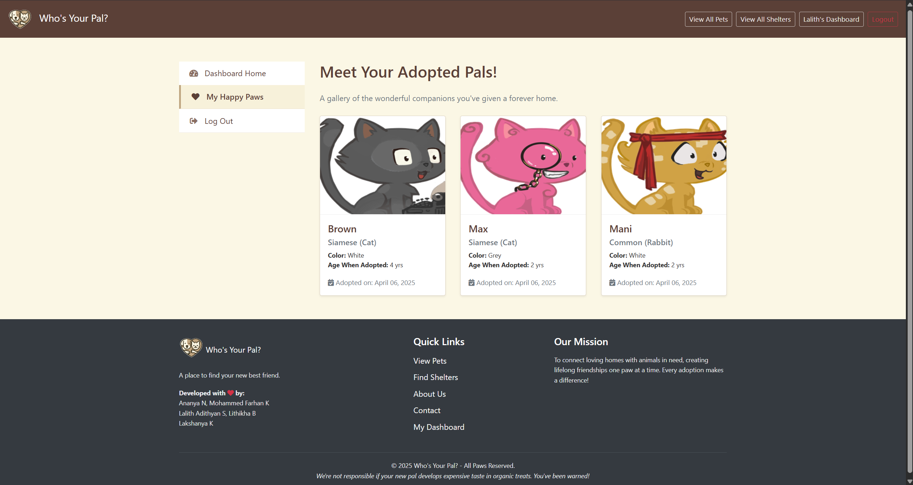 | <!-- Added this based on your files -->

## Features

### User (Adopter) Features:

*   **Registration & Login:** Secure user account creation and authentication.
*   **Browse Pets:** View a filterable list of available pets from all shelters (`All_Pets.png`).
*   **Filter Pets:** Filter pets by species, age, shelter, and color.
*   **View Pet Details:** See detailed information about a specific pet (`Pet_Info.png`).
*   **Browse Shelters:** View a list of participating shelters and their details.
*   **View Shelter Pets:** See pets available specifically at one shelter.
*   **Initiate Adoption:** Start the adoption process for a chosen pet (includes collecting basic adopter info if not already provided).
*   **User Dashboard:** View adoption statistics (adopted count, in-progress count) and recent application statuses (`Dashboard.png`).
*   **My Pets:** View a list of pets successfully adopted by the user (`Owned_Pets.png`).

### Admin (Shelter Staff) Features:

*   **Secure Admin Login:** Admins log in via the main login but are redirected to the admin area. Admin accounts are linked to a specific shelter.
*   **Admin Dashboard:** View key statistics for their specific shelter (pending adoptions, available pets, total adoptions) (`Admin_Dashboard.png`).
*   **Add New Pets:** Add new pets available for adoption at their shelter (`Add_New_pet.png`).
*   **Manage Shelter Listings:** View, filter, and search through pets currently listed by their shelter, including their adoption status (`All_Pets_Shelter.png`).
*   **Manage Adoption Applications:** View incoming adoption requests for their shelter's pets. Filter/sort applications (`Adoption_Requests.png`).
*   **Update Adoption Status:** Approve ('Successful'), reject ('Cancelled'), or mark applications as ('Underway'). (`Adoption_Request_Updated.png` likely shows result).
*   **Manage Medical Records:** View and add medical history entries for pets belonging to their shelter (`Add_Medical_Record.png`).

### General Features:

*   **Role-Based Access Control:** Clear separation of features and data access between regular users and shelter admins.
*   **Database Driven:** Uses MySQL to store and manage all data.
*   **Secure Password Handling:** Uses Flask-Bcrypt.
*   **Session Management:** Uses Flask-Login.
*   **Environment Configuration:** Loads sensitive data from a `.env` file.

## Technology Stack

*   **Backend:** Python 3, Flask
*   **Database:** MySQL (or compatible like MariaDB)
*   **Database Connector:** PyMySQL
*   **Authentication/Security:** Flask-Login, Flask-Bcrypt
*   **Templating:** Jinja2 (via Flask)
*   **Frontend:** HTML, CSS, JavaScript (basic interactions, AJAX for medical records)
*   **Environment Variables:** python-dotenv

## Getting Started / Setup

Follow these steps to set up and run the project locally:

### Prerequisites:

*   Python 3.7+
*   Pip (Python package installer)
*   Git
*   MySQL Server (or equivalent like MariaDB) running

### 1. Clone the Repository

```bash
git clone https://github.com/YOUR_USERNAME/YOUR_REPOSITORY_NAME.git # Replace with your repo URL
cd YOUR_REPOSITORY_NAME
```

### 2. Database Setup

*   Ensure your MySQL server is running.
*   Connect to your MySQL server using a client or the command line (e.g., `mysql -u root -p`).
*   Create the database for the application. Choose a suitable name and use UTF8MB4 character set for broad compatibility:
    ```sql
    CREATE DATABASE your_db_name CHARACTER SET utf8mb4 COLLATE utf8mb4_unicode_ci;
    ```
    *(Replace `your_db_name` with your actual database name)*

*   Create a dedicated database user for the application (recommended for security) and grant it the necessary privileges **only** on the database you just created:
    ```sql
    -- Create the user (replace 'your_db_user' and 'your_strong_password')
    CREATE USER 'your_db_user'@'localhost' IDENTIFIED BY 'your_strong_password';

    -- Grant privileges on the specific database (replace 'your_db_name' and 'your_db_user')
    GRANT ALL PRIVILEGES ON your_db_name.* TO 'your_db_user'@'localhost';

    -- Apply the changes
    FLUSH PRIVILEGES;

    -- Exit the MySQL client
    EXIT;
    ```
    *(Remember to replace `your_db_user`, `your_strong_password`, and `your_db_name` with your actual values)*

*   **Create Tables:** The application **does not** automatically create the database tables. You **must** manually create them *before* running the application for the first time. Use the following table structure as a guide, derived from the application's code (`app.py`). Execute these `CREATE TABLE` statements using your MySQL client connected to `your_db_name`:

    ```sql
    -- Users Table
    CREATE TABLE users (
        id INT AUTO_INCREMENT PRIMARY KEY,
        username VARCHAR(100) NOT NULL,
        email VARCHAR(120) NOT NULL UNIQUE,
        password_hash VARCHAR(255) NOT NULL,
        admin TINYINT(1) DEFAULT 0, -- 0 for user, 1 for admin
        SHELTER_ID INT NULL, -- FK to SHELTERS, only for admins
        INDEX idx_email (email),
        FOREIGN KEY (SHELTER_ID) REFERENCES SHELTERS(SHELTER_ID) ON DELETE SET NULL ON UPDATE CASCADE
    ) ENGINE=InnoDB DEFAULT CHARSET=utf8mb4 COLLATE=utf8mb4_unicode_ci;

    -- Shelters Table
    CREATE TABLE SHELTERS (
        SHELTER_ID INT AUTO_INCREMENT PRIMARY KEY,
        NAME VARCHAR(255) NOT NULL,
        LOCATION VARCHAR(255), -- Consider TEXT if longer address needed
        CONTACT_INFO TEXT -- Assuming contact info can be longer
    ) ENGINE=InnoDB DEFAULT CHARSET=utf8mb4 COLLATE=utf8mb4_unicode_ci;

    -- Pets Table
    CREATE TABLE PETS (
        PET_ID INT AUTO_INCREMENT PRIMARY KEY,
        SHELTER_ID INT NOT NULL,
        NAME VARCHAR(100) NOT NULL,
        SPECIES VARCHAR(50),
        BREED VARCHAR(100),
        COLOR VARCHAR(50),
        AGE DECIMAL(4,1), -- e.g., 3.5 years
        HEIGHT INT NULL, -- Assuming whole numbers, e.g., cm
        WEIGHT DECIMAL(5,2) NULL, -- e.g., 12.50 kg
        MISC TEXT NULL, -- Description
        AMOUNT DECIMAL(10, 2) NOT NULL, -- Adoption fee
        DATE_LISTED TIMESTAMP DEFAULT CURRENT_TIMESTAMP, -- When added
        FOREIGN KEY (SHELTER_ID) REFERENCES SHELTERS(SHELTER_ID) ON DELETE CASCADE ON UPDATE CASCADE, -- If shelter removed, remove pets
        INDEX idx_shelter_id (SHELTER_ID),
        INDEX idx_species (SPECIES)
    ) ENGINE=InnoDB DEFAULT CHARSET=utf8mb4 COLLATE=utf8mb4_unicode_ci;

    -- Adopter Details Table
    CREATE TABLE ADOPTER (
        ADOPTER_ID INT PRIMARY KEY, -- This IS the user's ID
        NAME VARCHAR(100), -- Can be redundant with users.username
        AGE INT,
        GENDER CHAR(1), -- M, F, O
        FOREIGN KEY (ADOPTER_ID) REFERENCES users(id) ON DELETE CASCADE ON UPDATE CASCADE
    ) ENGINE=InnoDB DEFAULT CHARSET=utf8mb4 COLLATE=utf8mb4_unicode_ci;

    -- Adoptions Table
    CREATE TABLE ADOPTIONS (
        ADOPTION_ID INT AUTO_INCREMENT PRIMARY KEY,
        PET_ID INT NOT NULL,
        SHELTER_ID INT NOT NULL, -- Can be derived from PET_ID but useful for direct shelter filtering
        ADOPTER_ID INT NOT NULL,
        ADOPTION_STATUS VARCHAR(50) DEFAULT 'Pending', -- e.g., Pending, Underway, Successful, Cancelled
        ADOPTION_DATE TIMESTAMP DEFAULT CURRENT_TIMESTAMP, -- When application was made
        PAYMENT_STATUS VARCHAR(50) DEFAULT 'Pending', -- e.g., Pending, Paid
        AMOUNT DECIMAL(10, 2), -- Fee at time of adoption
        FOREIGN KEY (PET_ID) REFERENCES PETS(PET_ID) ON DELETE RESTRICT ON UPDATE CASCADE, -- Don't delete pet if adoption exists? Or CASCADE? Needs thought. RESTRICT is safer initially.
        FOREIGN KEY (SHELTER_ID) REFERENCES SHELTERS(SHELTER_ID) ON DELETE CASCADE ON UPDATE CASCADE,
        FOREIGN KEY (ADOPTER_ID) REFERENCES users(id) ON DELETE CASCADE ON UPDATE CASCADE,
        INDEX idx_adopter_pet (ADOPTER_ID, PET_ID),
        INDEX idx_shelter_status (SHELTER_ID, ADOPTION_STATUS)
    ) ENGINE=InnoDB DEFAULT CHARSET=utf8mb4 COLLATE=utf8mb4_unicode_ci;

    -- Medical Records Table (using MEDICINES name from code)
    CREATE TABLE MEDICINES (
        RECORD_ID INT AUTO_INCREMENT PRIMARY KEY, -- Added a primary key
        PET_ID INT NOT NULL,
        `DATE` DATE NOT NULL, -- Use backticks as DATE is a reserved word
        VET_NAME VARCHAR(255) NULL,
        TREATMENT TEXT NULL,
        MEDICINE TEXT NULL,
        FOREIGN KEY (PET_ID) REFERENCES PETS(PET_ID) ON DELETE CASCADE ON UPDATE CASCADE,
        INDEX idx_pet_date (PET_ID, `DATE` DESC)
    ) ENGINE=InnoDB DEFAULT CHARSET=utf8mb4 COLLATE=utf8mb4_unicode_ci;
    ```
    *(Note: Foreign key constraints and indexing added for better relational integrity and performance. Adjust `ON DELETE` behavior as needed for your specific logic requirements.)*

  ### 3. Environment Variables

*   Create a file named `.env` in the root directory of the project (the same directory as `app.py`).
*   Add the following environment variables to the `.env` file. **Replace the placeholder values** with your actual database credentials and generate a strong, unique secret key.

    ```dotenv
    # Flask Configuration
    SECRET_KEY='your_very_strong_and_secret_key_here_32_chars_or_more' # Generate a strong random key

    # Database Configuration
    DB_HOST='localhost'         # Or your MySQL server IP/hostname if not local
    DB_USER='your_db_user'      # The database user you created/chose
    DB_PASSWORD='your_strong_password' # The password for the database user
    DB_NAME='your_db_name'      # The database name you created
    DB_PORT='3306'              # Default MySQL port, change if different
    DB_CHARSET='utf8mb4'        # Recommended character set
    ```
    **Important:** Keep your `.env` file secure. Ensure it is listed in your `.gitignore` file so it's **never** committed to version control.

### 4. Install Dependencies

*   It is **highly recommended** to use a Python virtual environment to manage project dependencies and avoid conflicts with system-wide packages.

    ```bash
    # Navigate to your project directory in the terminal
    cd YOUR_REPOSITORY_NAME

    # Create a virtual environment named 'venv'
    python -m venv venv  # Use 'python3' if 'python' defaults to Python 2

    # Activate the virtual environment:
    # On macOS/Linux:
    source venv/bin/activate
    # On Windows (Command Prompt/PowerShell):
    .\venv\Scripts\activate
    ```
    *(You should see `(venv)` preceding your terminal prompt)*

*   Install the required Python packages listed in `requirements.txt` using pip:

    ```bash
    pip install -r requirements.txt
    ```
    *(**Note:** If you haven't created `requirements.txt` yet, activate your virtual environment, ensure all needed packages like `Flask`, `Flask-Bcrypt`, `Flask-Login`, `PyMySQL`, `python-dotenv` are installed (`pip install Flask Flask-Bcrypt ...`), and then run: `pip freeze > requirements.txt`)*

### 5. Run the Application

*   Make sure your virtual environment is still activated (`(venv)` is visible in your prompt).
*   Ensure your MySQL server is running and the database/tables have been created (Step 2).
*   Run the Flask development server from your project's root directory:

    ```bash
    python app.py
    ```
*   The application will start, and the terminal will show output similar to this:

    ```
     * Serving Flask app 'app'
     * Debug mode: on  # (Or off depending on your code)
    WARNING: This is a development server. Do not use it in a production deployment. Use a production WSGI server instead.
     * Running on http://127.0.0.1:5000
    Press CTRL+C to quit
    ```
*   Open your web browser and navigate to the address shown, typically: `http://127.0.0.1:5000/` or `http://localhost:5000/`

## Database Schema

The application relies on the following core database tables:

*   `users`: Stores user credentials, roles (user/admin), and links admins to shelters.
*   `SHELTERS`: Stores information about participating shelters.
*   `PETS`: Contains details about each adoptable pet, linked to its shelter.
*   `ADOPTIONS`: Tracks adoption application status, linking users, pets, and shelters.
*   `ADOPTER`: Stores additional adopter-specific information collected during the process.
*   `MEDICINES`: Logs medical history entries for pets.

*(Refer to the `CREATE TABLE` statements in the Database Setup section or the `app.py` code for detailed column information)*

## Future Scope

*   **Multimedia Support:** Allow uploading and displaying images/videos for pets.
*   **Advanced Adoption Applications:** Implement detailed application forms and review workflows.
*   **Enhanced Search/Matching:** Improve search filters and potentially add "pet alert" features.
*   **Real-Time Notifications:** Alert admins and users about application updates instantly.
*   **Shelter Analytics:** Provide admins with detailed dashboards on adoption trends and statistics.
*   **Direct Messaging:** Enable communication between adopters and shelters within the platform.
*   **Structured Medical History:** Refine the medical records with predefined event types and document attachments.

## Contributing

Contributions are welcome! If you'd like to contribute, please follow these steps:
1.  Fork the repository.
2.  Create a new branch (`git checkout -b feature/YourFeature`).
3.  Make your changes.
4.  Commit your changes (`git commit -m 'Add some feature'`).
5.  Push to the branch (`git push origin feature/YourFeature`).
6.  Open a Pull Request.

For major changes, please open an issue first to discuss what you would like to change.
